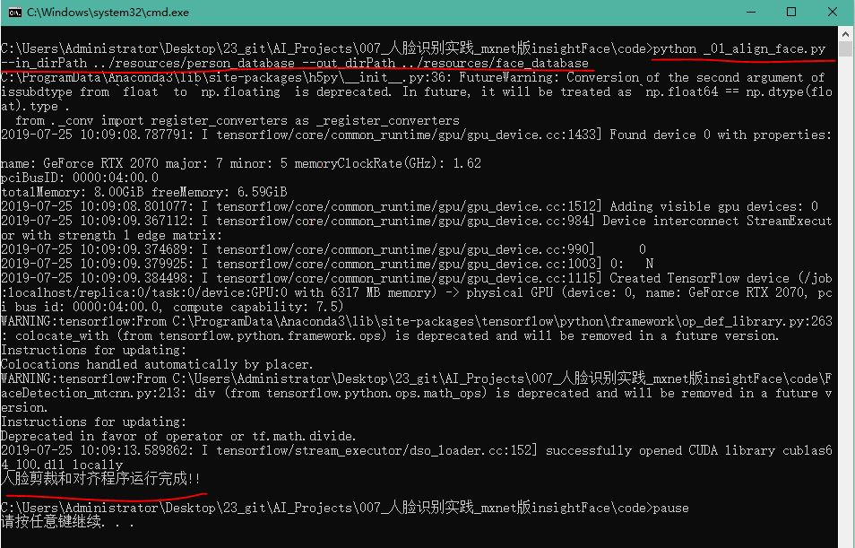
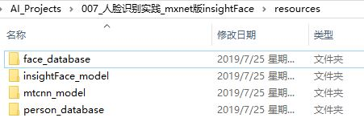
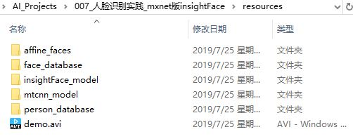

# 人脸识别实践_mxnet版InsightFace
* InsightFace工程在人脸识别开源工程中准确率很高，本文使用InsightFace工程中提供的预训练模型，
把112x112的人脸图像转换为512维的特征向量，向量即1维数组。
* 本工程中提供的代码可支持最高1万数量的人脸数据库的人脸对比，超过此数量人脸对比速度较慢。
* 本工程宗旨为人脸识别的入门者提供直接使用和演示的样例程序，节省读者的学习时间。
* 如果读者需要增加其他人的人脸识别，请阅读本篇文章第1.1节
* 工业实践中完整的人脸识别项目包含4步：人脸检测、人脸对齐、人脸识别、活体识别，
* 本工程包含3步：人脸检测、人脸对齐、人脸识别，读者开发实际应用需要添加活体识别功能。

## 致谢
1. 本文基于`Jia Guo`和邓健康的github工程《[InsightFace](https://github.com/deepinsight/insightface)》 学习使用InsightFace模型
2. 本文基于`davidsandberg`的github工程《[facenet](https://github.com/davidsandberg/facenet)》 学习使用mtcnn模型做人脸检测

## 配置代码运行环境
* 读者需要先根据自己的Nvidia品牌显卡的型号，安装对应的CUDA版本。
* 根据作者的经验，Nvidia品牌20系列显卡需要安装CUDA10，否则运行代码会报错。
* 安装4个组件：CUDA10、cudnn7.6、mxnet-cu100、tensorflow_gpu1.13。
* 作者提供4个组件的百度云下载链接: https://pan.baidu.com/s/1OlKO1fD3C0gdsT-kocfQUg 提取码: 7n15
* 如果读者的显卡为Nvidia品牌10系列，则仍然可以使用CUDA9及其相关组件。

### 硬件配置要求
大于等于6G显存的Nvidia品牌显卡

### 软件配置要求
各种软件版本：
* 操作系统: Windows10
* Anaconda： 5.2
* python: 3.6
* CUDA: 10.0
* cudnn: 7.6.1
* tensorflow_gpu: 1.13.1
* mxnet-cu100
* opencv_python: 4.1.0

## 0.下载资源
阅读[resources/readme.md](resources/)，并完成其中内容

## 1.剪裁和对齐人脸

### 1.1 添加人物图片
* 在文件夹`resources/person_database`中，作者提供4个中国明星的图片，即数据库现有4人。
* 读者根据自己需要，依照人名新建文件夹，然后把此人对应的图片放入其中。
* 如下图所示：

### 1.2 人物图片转化为人脸图片
* 本质上，命令脚本文件`code/_01_运行人脸剪裁及对齐程序.cmd`调用代码文件`_01_align_face.py`
* 读者可以用记事本打开命令脚本文件，查看其中内容。
* 双击命令脚本文件`code/_01_运行人脸剪裁及对齐程序.cmd`，程序运行完成的结果如下图所示：

* 程序运行完成后，文件夹`resources`中新增文件夹`face_database`，如下图所示：

## 2.运行人脸识别工程
* 本质上，命令脚本文件`code/_02_运行示例程序.cmd`调用代码文件`_02_demo.py`
* 双击命令脚本文件`code/_02_运行示例程序.cmd`，程序运行的结果如下图所示：
* 在程序运行的过程中，按Esc键或者q键可以退出程序。
* 如果不需要显示人脸的5个关键点，则删除命令脚本文件`code/_02_运行示例程序.cmd`中的`--show_keypoints`

* 建议读者阅读代码文件`_02_demo.py`，代码中变量命名具有实际意义，易于读者理解，在关键处均含有注释。
* 程序运行完成后，文件夹`resources`中新增文件夹`affine_faces`和视频文件`demo.avi`，如下图所示：
