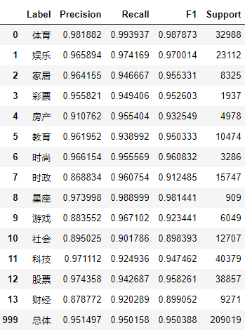

# 文章内容概述
* 此篇文章的第1个版本链接：《[基于tensorflow、CNN、清华数据集THUCNews的新浪新闻文本分类](https://www.jianshu.com/p/db8824205fc3)》
* 本文为第2个版本，本文作者在工作10个月后，重构并优化代码，更新内容如下：
    1. 代码中正确使用[PAD]，把模型准确率从0.92提高到0.94
    2. 使用带有权重的样本抽取策略，解决了样本不均衡问题
    3. 更改网络结构，从而提高模型准确率。
    4. 编写BatchDataGenerator类，使用多线程减小内存占用量，提高模型训练速度。
    5. 减小中间变量占用内存量，使代码在8G内存的电脑也可以运行。
    6. 之前的代码在linux内核的Ubuntu系统无法运行，在Windows10系统可以运行。
    修改后的代码可以在linux内核的Ubuntu系统运行。
    7. 增加了动态更新进度条的功能，使jupyter界面中的输出显示更简洁。
* 数据集THUCNews有80万篇左右新闻，本文按照3:1的比例划分训练集、测试集。
* 在训练集上做模型训练，在测试集上做模型测试，取得的成果如下表所示，读者可以轻松复现：

# 0.编程环境
操作系统：Windows10
python版本: 3.6
开发环境：jupyter notebook
tensorflow_gpu版本：1.13.1(读者根据自己的CUDA版本可以自行选择)
内存要求：8G
显存要求：2G

# 1.致谢声明
本文学习`gaussic`的github工程《[使用卷积神经网络以及循环神经网络进行中文文本分类](https://github.com/gaussic/text-classification-cnn-rnn)》

# 2.使用指南
1. 阅读[resources/readme.md](resources/)，并完成其中内容
2. 读者打开代码文件`code/_01_textCnn.ipynb`，按照顺序运行代码块即可。
