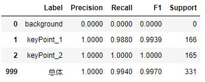

# 复写代码_pytorch版关键点的目标检测

图像识别学习QQ群：111958809

## 致谢
1. 本文学习`王松`的github工程:《[RFSong-779](https://github.com/songwsx/RFSong-779 )》
2. 本文学习`王松`的知乎博客:《[模型参数量小于1M的行人检测网络](https://zhuanlan.zhihu.com/p/76491446)》
    * 也欢迎大家加入这个大佬的QQ群：763679865

## 下载资源
* 阅读[resources/readme.md](resources/)，并完成其中内容。

## 工程需求说明

1. 在1920x320像素的原图上找出30x30像素的关键点位置
2. 要求定位平均误差 < 3像素
3. 要求定位平均速度 > 10FPS, 即每张图片推理耗时 < 0.1s
4. 模型具有一定的健壮性，适应轻微的环境变化。|

#### 模型评估结果


## 常见问题及解答
1. 如何运行此工程?
```
读者需要自己搭建环境，包括安装：conda、cuda、cudnn、pytorch1.1+
根据官方文档：cuda9.0适合安装pytorch1.1、cuda10.0适合安装pytorch1.2
环境搭建后, 双击命令脚本文件`code/_01_训练模型.cmd`, 即可进入jupyter界面
在jupyter界面中按照顺序运行代码即可
```

2. 工程需要的电脑配置？
```
电脑显卡必须是Nvidia系列，显存大于4G即可。
内存 >= 8G，因为程序需要占用5G内存
```
    
3. 模型训练并保存权重后，如何加载模型(实际中如何使用模型)？
```
任何框架：包括tf、keras、pytorch, 加载模型的思路都是下面2步：
1.先搭建好神经网络，
2.然后把权重加载进网络    
```

4. 刚入门深度学习(想做图像识别)，如何逐步提高自己?
* 查看博主的文章: 《[人工智能图像识别从业人员考核标准](https://github.com/StevenLei2017/AI_projects/tree/master/003_人工智能图像识别领域从业人员的考核标准)》

5. 本文知识点列举
```
1. 快速搭建pytorch_cuda版本的运行环境
2. 模型训练时，动态刷新进度条的实现代码
3. 本文作者制定的命名规范, 有利于自己和读者理解变量的含义和作用:
    dict、list、set等数据类型的变量，例如：imageFilePath_list、id2name_dict
    numpy.ndarray数据类型的变量，例如: images_4dArray、index_1dArray
    torch.Tensor数据类型的变量，例如: gtOffset_3d、gtClassId_2d
4. 如何读取标注软件LabelImg生成的xml文件
5. 读取图片文件的2种方式及其对比：PIL库读图片、cv2库读图片
6. uint8数据类型与float32数据类型理解、实际运用效果对比：
    float32占用内存、图片输入数据从内存到显存如何加速(提高4倍速度)
7. 线程的理解, python中如何编写线程类, 线程类的使用场景
8. 队列的理解, python中如何使用队列, 队列中的数据如何入队、出队
9. torch库中如何编写nn.Module类, 理解__init__、forward方法并正确编写代码
10. pytorch中padding与kernel_size的关系, stride的作用
11. 理解卷积核、卷积过程，能够正确得出卷积前后矩阵形状,
12. 如何安排网络中BN、ReLU、Conv层的顺序
13. 本工程中为了解决单尺度的目标检测问题，32倍下采样的原因？   
    特征图中的特征点的感受野, 特征点的5个值含义: 
        △x(x偏移量), △y(y偏移量), c0(背景类概率), c1(类别1概率), c2(类别2概率)
14. 简化网络后为什么只使用1个特征图、1个Anchor
    特定问题巧妙地规避计算iou、输出结果时nms、更复杂的编码解码这3个步骤
15. 本工程与SSD中的PriorBox的区别, 理解OneStage网络中Anchor
16. 了解图像识别工程的流程:
    数据准备-->搭建神经网络-->定义损失函数-->在训练集上训练模型-->在测试集上测试模型
        -->模型评估-->模型使用(模型保存、模型加载)-->模型部署(开发网络接口、Docker)
17. 理解SSD中的match: 把真实值转化为偏移值(gtBox-->gtOffset)        
18. 理解pytorch中tensor.to('cuda')、net.to('cuda'), 用于判断变量在内存还是显存
19. numpy与pytorch对矩阵操作的常用方法:
    索引切片(取出指定位置值)、扩展维度、转换维度、取满足指定条件的矩阵部分
20. 理解F.softmax并运用, 正确设置参数dim        
21. 损失函数 = 定位损失 + 置信度损失 * u
    定位损失(回归问题)使用MSE, 置信度损失(分类问题)使用CrossEntropy
    u 表示对置信度损失的偏重程度, 按照自己的理解设置即可。
    合理设计损失使模型达到最佳效果(即人们常说的调参)
22. 需要注意的点：pytorch中正确使用CrossEntropyLoss
    Input, Target参数理解：Input是2维矩阵(N x C) Target是1位矩阵(N)
    查看文档的2种方法：jupyter中使用?号、pytorch官网查看Doc页面
23. pytorch中如何使用torch.device
24. 使用学习率规划, 本工程中方法：每隔一定步数、学习率减半
25. 理解模型训练过程中epoch和batch_size
26. 适用于低显存的显卡的方法： 
        每步都反向传播, 但是每隔2步才更新权重, 巧妙地实现batch_size * 2
    通过实践理解pytorch代码中这3行代码的意义和作用：
    optimizer.zero_grad()
    loss.backward()
    optimizer.step()
27. 模型测试和使用时，如何把网络输出结果+PriorBox(先验框)
        转换为需要的预测边界框列表pBox_list, 预测类别列表pClassId_list
28. 使用模型预测结果绘制带有边界框、文字等内容的预测结果图(检测效果图)
29. 先理解单分类问题的准确率、召回率, 再理解多分类问题的准确率、召回率
    推荐链接：https://zhuanlan.zhihu.com/p/43068926
30. 如何把目标检测的真实值、预测值(含有预测类别+位置)
        转换为真实类别列表、预测类别列表, 从而得到目标检测的模型评估结果
31. pytorch中如何保存模型、加载模型
32. 模型的网络结构分析、显存占用分析, 深入理解卷积层、BN层的参数量
```


    